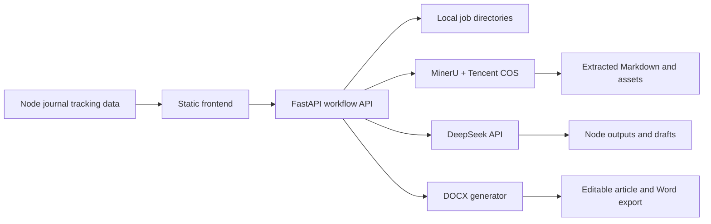
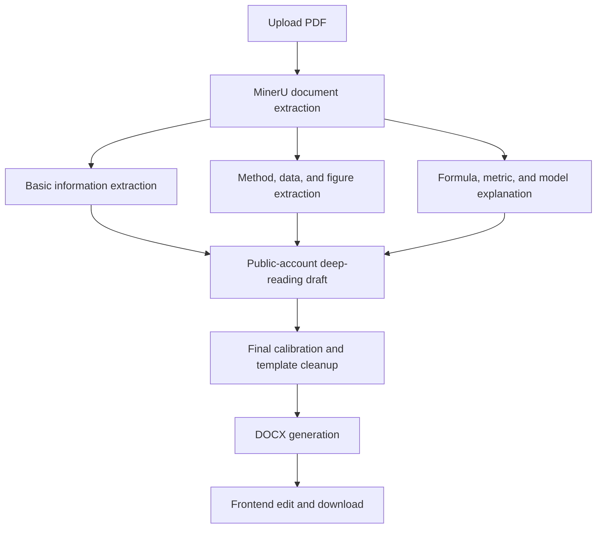
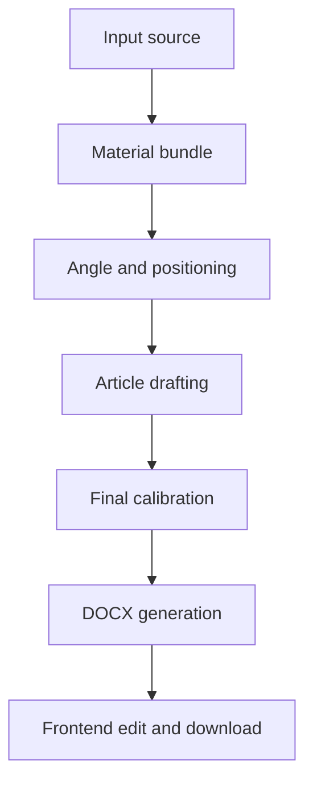

# Paper Reading And WeChat Writing Workflows Design

Date: 2026-06-04

## Goal

Add two local content-production workflows to the Science Workshop prototype:

1. Paper reading: users upload a PDF paper and generate a public-account deep-reading article similar to "研读非洲｜第 X 期".
2. WeChat writing: users generate public-account drafts from a paper-reading result, a tracked journal article, and optional user-supplied materials.

The first implementation should complete the local backend workflow before expanding the frontend board. The existing journal tracking pipeline remains intact.

## Decisions

- Architecture: add a lightweight FastAPI backend beside the existing static frontend and Node crawler scripts.
- Model provider: call DeepSeek directly from the backend.
- PDF extraction: use MinerU, with Tencent COS as the temporary transfer path, following the reference approach in `/Users/yuzhou4tc/Public/公文/renhang_smartreport`.
- Job status: use SSE for realtime progress and polling as the recovery fallback.
- Storage: save each job as a local directory with JSON status files and artifacts.
- Retention: keep complete job evidence chains for 3 days by default, then delete expired job directories.
- Scope: paper reading is end-to-end in v1; WeChat writing is lightweight but usable in v1.
- Output: backend saves the full evidence chain; frontend exposes editable article text and Word export.
- Figures and formulas: embed assets in Word when extraction is reliable; otherwise keep explanations, source references, and placeholders.
- Execution mode: run jobs automatically by default, while supporting node-level edits, partial reruns, and Word regeneration.
- Templates: ship with a default "研读非洲｜第 X 期" template and keep the template contract extensible.

## System Boundary

The existing project remains a static prototype plus local Node.js crawler workflow:

- `index.html` continues to render journal tracking, source inventory, and article timelines.
- `data/adapter-profiles.json`, `data/recent-front-data.js`, and the existing `scripts/*.mjs` workflow remain the journal-tracking source of truth.
- The new FastAPI backend owns upload handling, workflow execution, evidence persistence, DeepSeek calls, MinerU calls, and Word generation.

The frontend will call the backend through local API endpoints instead of embedding workflow logic into `index.html`.

## High-Level Architecture



Expected local services:

- Static frontend can continue to be opened from disk or served by a simple local HTTP server.
- FastAPI backend runs as a separate local service.
- The backend reads secrets from `.env`; no API secrets are written into frontend files.

## Paper Reading Workflow

The paper-reading workflow creates a deep-reading article from an uploaded PDF:



Node responsibilities:

- Document extractor: convert PDF or document content into Markdown and extract available assets through MinerU.
- Basic information extraction: title, authors, journal, year, abstract, research question, and core conclusions.
- Method, data, and figure extraction: data sources, sample scope, methods, identification strategy, figure/table meanings, and key numbers.
- Formula, metric, and model explanation: formulas, metric definitions, variable construction, statistical models, and calculation logic.
- Public-account deep-reading writing: integrate the three extraction branches into a complete article.
- Final calibration/template cleanup: remove `<think>`, JSON residue, prompt residue, appendix residue, and unify the public-account format.
- DOCX generation: generate a Word file from the latest final Markdown and available assets.

The target article structure includes title, literature information, introduction, research background, core findings, research design and methods, figure/data interpretation, further discussion, conclusion, citation format, and closing section.

## WeChat Writing Workflow

The v1 WeChat writing workflow is lightweight and production-oriented:



Supported input sources:

- Paper-reading result: reuse the paper-reading final article, structured extraction outputs, and literature metadata.
- Tracked journal article plus user materials: start from an existing article id and its current tracking metadata, then let the user upload a PDF, paste text, or add writing requirements.

Node responsibilities:

- Material bundle: collect paper-reading outputs, journal metadata, uploaded files, pasted text, and user instructions.
- Angle and positioning: define the target reader, article angle, core claim, and title direction.
- Article drafting: generate the public-account draft.
- Final calibration: remove prompt residue, JSON residue, appendix residue, and awkward formatting.
- DOCX generation: generate a Word file from the latest final Markdown.

The WeChat workflow can reuse a paper-reading evidence chain, but it does not require every article to rerun the full PDF extraction pipeline.

## Job Storage And Evidence Chain

Each job is stored under the configured workflow storage directory:

```text
storage/workflow_jobs/{job_id}/
  job.json
  input/
    input.pdf
    source_bundle.json
  extraction/
    extracted.md
    extraction_meta.json
    mineru_assets/
  nodes/
    basic_info.json
    basic_info.md
    method_data_figures.json
    method_data_figures.md
    formula_metrics.json
    formula_metrics.md
    angle.md
    draft.md
    final.md
  exports/
    final.docx
```

`job.json` tracks:

- job id, workflow type, template id, creation time, update time, and expiration time.
- current status: queued, running, completed, failed, expired.
- node statuses: pending, running, completed, failed, skipped.
- node inputs, outputs, timestamps, error messages, and retry counts.
- available artifacts and download paths.

Retention behavior:

- Complete evidence chains are retained for 3 days by default.
- Expired job directories are removed by a backend cleanup routine.
- Opening an expired job should return a clear "result expired, rerun required" response.

## Node Editing And Rerun Rules

The default run completes automatically from upload to Word export. Users can still edit node outputs and rerun downstream work:

- Editing `basic_info`, `method_data_figures`, or `formula_metrics` reruns article drafting, final calibration, and DOCX generation.
- Editing `draft.md` reruns final calibration and DOCX generation.
- Editing `final.md` reruns only DOCX generation.
- MinerU extraction can be retried if the extraction node fails.

The backend should keep node boundaries explicit so future UI controls can expose node-level edits without changing the workflow model.

## API Design

Core endpoints:

```text
POST /api/workflows/paper-reading/jobs
POST /api/workflows/wechat-writing/jobs
GET /api/jobs/{job_id}
GET /api/jobs/{job_id}/events
PATCH /api/jobs/{job_id}/nodes/{node_id}
POST /api/jobs/{job_id}/rerun
POST /api/jobs/{job_id}/export/docx
GET /api/jobs/{job_id}/artifacts/{artifact_name}
```

Endpoint behavior:

- `POST /api/workflows/paper-reading/jobs` accepts a PDF upload and workflow options such as template id, issue number, and title preferences.
- `POST /api/workflows/wechat-writing/jobs` accepts a paper-reading job id, an article id, supplementary text, and optional files.
- `GET /api/jobs/{job_id}` returns current status, node status, artifact links, and editable output summaries.
- `GET /api/jobs/{job_id}/events` streams progress through SSE.
- `PATCH /api/jobs/{job_id}/nodes/{node_id}` edits a node artifact.
- `POST /api/jobs/{job_id}/rerun` reruns from a selected node or downstream boundary.
- `POST /api/jobs/{job_id}/export/docx` regenerates Word from the current final content.
- `GET /api/jobs/{job_id}/artifacts/{artifact_name}` returns Markdown, DOCX, or evidence artifacts.

SSE is the primary progress channel. Polling via `GET /api/jobs/{job_id}` is the recovery path for refreshes, reconnects, and opened historical jobs.

## Frontend Design

Add two user-facing boards after the local backend workflow exists.

Paper reading board:

- PDF upload.
- Template selection with "研读非洲｜第 X 期" as the default.
- Progress timeline for upload, MinerU extraction, three extraction branches, drafting, calibration, and Word generation.
- Editable final article view.
- Folded evidence-chain view for node outputs.
- Node edit, partial rerun, and DOCX export controls.

WeChat writing board:

- Start from a paper-reading result, a tracked journal article, or user-supplied materials.
- Accept supplementary text or uploaded files.
- Show article angle, draft, final text, and Word export.
- Allow editing the final text in the browser before exporting DOCX.

The frontend should not expose backend secrets and should not depend on workflow internals beyond the API contract.

## Word Export

The frontend editing surface is not a full Word clone. It should support practical browser editing of title, headings, paragraphs, and article body text, then export DOCX through the backend.

Figures, tables, and formulas:

- Embed MinerU assets when they are available and stable enough for Word.
- If an asset cannot be embedded reliably, keep a placeholder plus explanation, source page, paragraph, or figure number.
- Do not attempt to recreate the original paper layout in v1.

## Configuration

Backend configuration belongs in `.env`:

```text
DEEPSEEK_API_KEY
DEEPSEEK_BASE_URL
DEEPSEEK_MODEL

MINERU_API_KEY
MINERU_BASE_URL
MINERU_ENABLED

TENCENT_COS_SECRET_ID
TENCENT_COS_SECRET_KEY
TENCENT_COS_REGION
TENCENT_COS_BUCKET

WORKFLOW_STORAGE_DIR
WORKFLOW_RETENTION_DAYS=3
```

The design assumes local development first. Deployment storage and hosted secret management are out of scope for v1.

## Error Handling

Errors are recorded at node level:

- MinerU failure: stop at extraction, keep original PDF, COS upload status, and MinerU error details. Allow extraction retry.
- DeepSeek failure: mark only the failing node as failed, keep completed node outputs, and allow rerun from the failed node.
- DOCX failure: keep `final.md`, allow browser editing and copy, and allow DOCX regeneration.
- SSE disconnect: backend continues the job; frontend falls back to polling.
- Expired job: return a clear expired response and ask the user to rerun.

## Testing And Verification

Pure tests:

- job directory creation.
- `job.json` state transitions.
- retention cleanup.
- node dependency and downstream rerun calculation.
- artifact path resolution.

Service tests:

- FastAPI request validation.
- job status response.
- SSE event formatting.
- artifact download.
- DOCX generation from Markdown and optional assets.

Lightweight integration tests:

- run the full upload-to-DOCX flow with mocked MinerU and DeepSeek services.
- verify polling recovery after a simulated SSE disconnect.
- verify node edit and downstream rerun behavior.

Live smoke tests:

- run one real small PDF through MinerU and DeepSeek when API keys and network access are available.
- verify the resulting article, evidence files, and DOCX are present in the job directory.

## Out Of Scope For V1

- Hosted deployment and multi-user authentication.
- Full template-library UI and template version management.
- Full Word-like browser editor with comments, track changes, table editing, and pagination.
- Full reproduction of original paper figure and formula layout.
- Database-backed search across all historical jobs.
- Replacing the existing Node journal-tracking workflow.

## Success Criteria

- A local PDF can be turned into a "研读非洲｜第 X 期"-style deep-reading article.
- The backend preserves the complete evidence chain for every node.
- The user can edit the final article in the frontend and export DOCX.
- Failed nodes can be inspected and rerun without losing completed outputs.
- Job results are automatically removed after the configured retention window.
- The existing journal tracking page and daily workflow behavior remain unchanged.
